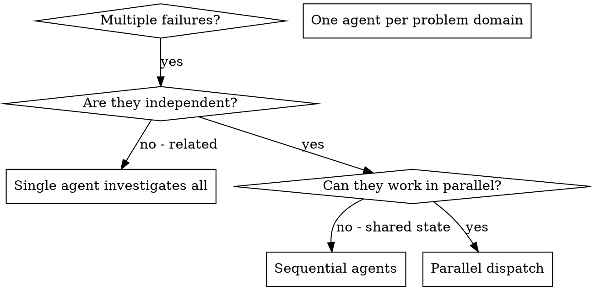

# Dispatching Parallel Agents

## Overview

Tasks are delegated to specialized agents with isolated context. Precisely crafted instructions and context keep each agent focused. Agents must not inherit the primary session's context or history; each receives exactly what is needed. This preserves the primary context for coordination.

When multiple unrelated failures occur across different test files, subsystems, or bugs, sequential investigation wastes time. Each investigation is independent and can proceed in parallel.

**Core principle:** Dispatch one agent per independent problem domain and let the agents work concurrently.

## When to Use



**Use when:**
- 3+ test files failing with different root causes
- Multiple subsystems broken independently
- Each problem can be understood without context from others
- No shared state between investigations

**Avoid when:**
- Failures are related (one fix might resolve others)
- Need to understand full system state
- Agents would interfere with each other

## The Pattern

For OpenCode Task calls, set `background=true` by default. A foreground call is justified only when the next step has a hard dependency on the result; do not wait for or poll background tasks from the main conversation.

### 1. Identify Independent Domains

Group failures by the broken domain:
- File A tests: Tool approval flow
- File B tests: Batch completion behavior
- File C tests: Abort functionality

Each domain is independent; fixing tool approval does not affect abort tests.

### 2. Create Focused Agent Tasks

Each agent gets:
- **Specific scope:** One test file or subsystem
- **Clear goal:** Make the specified tests pass
- **Constraints:** Do not change other code
- **Expected output:** Summary of findings and fixes

### 3. Dispatch in Parallel

Issue all three background subagent dispatches in the same response; they run in parallel while the main conversation remains available:

```text
Specialist subagent (background=true): "Fix agent-tool-abort.test.ts failures"
Specialist subagent (background=true): "Fix batch-completion-behavior.test.ts failures"
Specialist subagent (background=true): "Fix tool-approval-race-conditions.test.ts failures"
# All three run concurrently.
```

Multiple dispatch calls in one response = parallel execution. One per response = sequential.

### 4. Review and Integrate

When agents return:
- Read each summary
- Verify fixes do not conflict
- Run full test suite
- Integrate all changes

## Agent Prompt Structure

Good agent prompts are:
1. **Focused** - One clear problem domain
2. **Self-contained** - All context needed to understand the problem
3. **Specific about output** - What should the agent return?

```markdown
Fix the 3 failing tests in src/agents/agent-tool-abort.test.ts:

1. "should abort tool with partial output capture" - expects 'interrupted at' in message
2. "should handle mixed completed and aborted tools" - fast tool aborted instead of completed
3. "should properly track pendingToolCount" - expects 3 results but gets 0

These are timing/race condition issues. The task is to:

1. Read the test file and understand what each test verifies
2. Identify root cause - timing issues or actual bugs?
3. Fix by:
   - Replacing arbitrary timeouts with event-based waiting
   - Fixing bugs in abort implementation if found
   - Adjusting test expectations if testing changed behavior

Do NOT just increase timeouts; find the real issue.

Return: Summary of findings and fixes.
```

## Common Mistakes

**❌ Too broad:** "Fix all the tests" - the agent gets lost
**✅ Specific:** "Fix agent-tool-abort.test.ts" - focused scope

**❌ No context:** "Fix the race condition" - the agent does not know where
**✅ Context:** Paste the error messages and test names

**❌ No constraints:** Agent might refactor everything
**✅ Constraints:** "Do NOT change production code" or "Fix tests only"

**❌ Vague output:** "Fix it" - the resulting changes remain unknown
**✅ Specific:** "Return summary of root cause and changes"

## When NOT to Use

**Related failures:** Fixing one might fix others - investigate together first
**Need full context:** Understanding requires seeing entire system
**Exploratory debugging:** The failure is not yet understood
**Shared state:** Agents would interfere (editing same files, using same resources)

## Real Example from Session

**Scenario:** 6 test failures across 3 files after major refactoring

**Failures:**
- agent-tool-abort.test.ts: 3 failures (timing issues)
- batch-completion-behavior.test.ts: 2 failures (tools not executing)
- tool-approval-race-conditions.test.ts: 1 failure (execution count = 0)

**Decision:** Independent domains - abort logic separate from batch completion separate from race conditions

**Dispatch:**
```
Agent 1 → Fix agent-tool-abort.test.ts
Agent 2 → Fix batch-completion-behavior.test.ts
Agent 3 → Fix tool-approval-race-conditions.test.ts
```

**Results:**
- Agent 1: Replaced timeouts with event-based waiting
- Agent 2: Fixed event structure bug (threadId in wrong place)
- Agent 3: Added wait for async tool execution to complete

**Integration:** All fixes independent, no conflicts, full suite green

## Verification

After agents return:
1. **Review each summary** - Understand what changed
2. **Check for conflicts** - Did agents edit same code?
3. **Run full suite** - Verify all fixes work together
4. **Spot check** - Agents can make systematic errors
