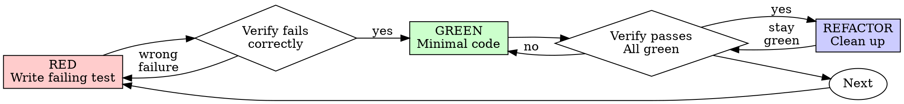

# Test-Driven Development (TDD)

## Overview

Write the test first, watch it fail, and write the minimum code required to pass.

**Core principle:** Without observing the test fail, there is no proof that it tests the right behavior.

**Violating the letter of the rules is violating the spirit of the rules.**

## When to Use

**Always:**
- New features
- Bug fixes
- Refactoring
- Behavior changes

**Exceptions require the human partner's permission:**
- Throwaway prototypes
- Generated code
- Configuration files

The thought "skip TDD just this once" is a rationalization and requires a stop.

## The Iron Law

```
NO PRODUCTION CODE WITHOUT A FAILING TEST FIRST
```

Code written before the test is deleted, and the work starts over.

**No exceptions:**
- Do not keep it as "reference"
- Do not "adapt" it while writing tests
- Do not look at it
- Delete means delete

Implement fresh from tests. Period.

## Red-Green-Refactor



### RED - Write Failing Test

Write one minimal test showing the required behavior.

<Good>
```typescript
test('retries failed operations 3 times', async () => {
  let attempts = 0;
  const operation = () => {
    attempts++;
    if (attempts < 3) throw new Error('fail');
    return 'success';
  };

  const result = await retryOperation(operation);

  expect(result).toBe('success');
  expect(attempts).toBe(3);
});
```
Clear name, real behavior, one concern
</Good>

<Bad>
```typescript
test('retry works', async () => {
  const mock = jest.fn()
    .mockRejectedValueOnce(new Error())
    .mockRejectedValueOnce(new Error())
    .mockResolvedValueOnce('success');
  await retryOperation(mock);
  expect(mock).toHaveBeenCalledTimes(3);
});
```
Vague name, mock rather than code
</Bad>

**Requirements:**
- One behavior
- Clear name
- Real code (no mocks unless unavoidable)

### Verify RED - Watch It Fail

**MANDATORY. Never skip.**

```bash
npm test path/to/test.test.ts
```

Confirm:
- Test fails (not errors)
- Failure message is expected
- Fails because feature missing (not typos)

**Test passes?** The test covers existing behavior. Correct the test.

**Test errors?** Correct the error and rerun until the test fails for the intended reason.

### GREEN - Minimal Code

Write the simplest code that passes the test.

<Good>
```typescript
async function retryOperation<T>(fn: () => Promise<T>): Promise<T> {
  for (let i = 0; i < 3; i++) {
    try {
      return await fn();
    } catch (e) {
      if (i === 2) throw e;
    }
  }
  throw new Error('unreachable');
}
```
Just enough to pass
</Good>

<Bad>
```typescript
async function retryOperation<T>(
  fn: () => Promise<T>,
  options?: {
    maxRetries?: number;
    backoff?: 'linear' | 'exponential';
    onRetry?: (attempt: number) => void;
  }
): Promise<T> {
  // YAGNI
}
```
Over-engineered
</Bad>

Do not add features, refactor unrelated code, or "improve" beyond the test.

### Verify GREEN - Watch It Pass

**MANDATORY.**

```bash
npm test path/to/test.test.ts
```

Confirm:
- Test passes
- Other tests still pass
- Output pristine (no errors, warnings)

**Test fails?** Correct the code, not the test.

**Other tests fail?** Correct them immediately.

### REFACTOR - Clean Up

After green only:
- Remove duplication
- Improve names
- Extract helpers

Keep tests green. Do not add behavior.

### Repeat

Proceed to the next failing test for the next feature.

## Good Tests

| Quality | Good | Bad |
|---------|------|-----|
| **Minimal** | One thing; split names containing "and". | `test('validates email and domain and whitespace')` |
| **Clear** | Name describes behavior | `test('test1')` |
| **Shows intent** | Demonstrates desired API | Obscures what code should do |

When writing or changing a test, read [writing-good-tests.md](writing-good-tests.md) for the rules that keep tests honest:
- Name the production change that would make the test fail — before writing it
- Assert on real behavior, never on mock behavior
- Keep test-only code in test utilities, out of production classes
- Understand a dependency's side effects before mocking it

## Common Rationalizations

| Excuse | Reality |
|--------|---------|
| "Too simple to test" | Simple code breaks. Test takes 30 seconds. |
| "Testing can happen after implementation" | Tests written after pass immediately — which proves nothing. They may test the wrong thing, test the implementation instead of the behavior, or miss an edge case. Without observing failure, there is no proof that the test catches the bug. Test-first development forces that proof. |
| "Tests after achieve the same goals (spirit, not ritual)" | Tests-after answer "what does this do?"; tests-first answer "what should this do?" Tests written after are biased by existing code — they verify remembered cases rather than cases that would have been discovered. Coverage without proof that the tests work is insufficient. |
| "Manual testing already happened" | Manual testing is ad hoc: there is no record of coverage, no reliable rerun when code changes, and cases are easy to forget under pressure. "Worked when tested" is not comprehensive. Automated tests run the same way every time. |
| "Deleting X hours is wasteful" | Sunk cost fallacy — that time is already spent either way. The real choice is rewriting with TDD for high confidence or keeping code and bolting on tests for low confidence and likely bugs. Keeping untrusted code is the waste. |
| "Keep as reference, write tests first" | The code will be adapted; that is testing after. Delete means delete. |
| "Need to explore first" | Exploration can be discarded before starting with TDD. |
| "Test hard = design unclear" | A hard-to-test design is usually hard to use. |
| "TDD will slow the work" | TDD IS the pragmatic path: it catches bugs before commit, prevents regressions, and permits refactoring without fear. "Pragmatic" shortcuts mean debugging in production — slower, not faster. |
| "Manual test faster" | Manual testing does not prove edge cases and requires retesting after every change. |
| "Existing code has no tests" | Improvement still requires tests for existing code. |

## Red Flags - STOP and Start Over

- Code before test
- Test after implementation
- Test passes immediately
- Unable to explain why the test failed
- Tests added "later"
- Rationalizing "just this once"
- "I already manually tested it"
- "Tests after achieve the same purpose"
- "It's about spirit not ritual"
- "Keep as reference" or "adapt existing code"
- "Already spent X hours, deleting is wasteful"
- "TDD is dogmatic, I'm being pragmatic"
- "This is different because..."

**All of these mean: Delete code. Start over with TDD.**

## Example: Bug Fix

**Bug:** Empty email accepted

**RED**
```typescript
test('rejects empty email', async () => {
  const result = await submitForm({ email: '' });
  expect(result.error).toBe('Email required');
});
```

**Verify RED**
```bash
$ npm test
FAIL: expected 'Email required', got undefined
```

**GREEN**
```typescript
function submitForm(data: FormData) {
  if (!data.email?.trim()) {
    return { error: 'Email required' };
  }
  // ...
}
```

**Verify GREEN**
```bash
$ npm test
PASS
```

**REFACTOR:** Extract validation for multiple fields when needed.

## Verification Checklist

Before marking work complete:

- [ ] Every new function/method has a test
- [ ] Watched each test fail before implementing
- [ ] Each test failed for expected reason (feature missing, not typo)
- [ ] Wrote minimal code to pass each test
- [ ] All tests pass
- [ ] Output pristine (no errors, warnings)
- [ ] Tests use real code (mocks only if unavoidable)
- [ ] Edge cases and errors covered

If every box cannot be checked, TDD was skipped; start over.

## When Stuck

| Problem | Solution |
|---------|----------|
| Unclear how to test | Write the wished-for API, write the assertion first, and ask the human partner. |
| Test too complicated | Design too complicated. Simplify interface. |
| Must mock everything | Code too coupled. Use dependency injection. |
| Test setup huge | Extract helpers. Still complex? Simplify design. |

## Debugging Integration

When a bug is found, write a failing test that reproduces it and follow the TDD cycle. The test proves the fix and prevents regression.

Never fix bugs without a test.

## Final Rule

```
Production code → test exists and failed first
Otherwise → not TDD
```

No exceptions without the human partner's permission.
